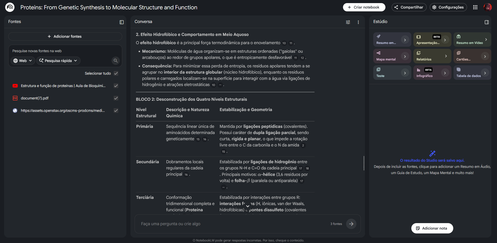

# 🧬 NotebookLM Project: Thematic Notebook on Proteins

> 🌐 **Read this in another language:** [Português](README-PT.md)

## 📋 Project Description
This repository contains the documentation and outcomes of developing a thematic study notebook using **NotebookLM** (Google). The project was built as part of the **Project Challenge: "Training a Learning AI: Exploring the Power of NotebookLM"** from the **DIO (Digital Innovation One)** platform, focusing on the in-depth study of **Proteins** (structure, functions, and biological significance).

---

## 🎯 Context and Objectives

### Chosen Topic
* **Theme:** Proteins (Biochemistry and Molecular Biology)
* **Justification:**
  1. *It is one of the core areas of study in my undergraduate degree (Biological Sciences).*
  2. *It features dense and complex content, requiring significant cognitive effort to be fully comprehended.*
  3. *It is a fundamental theme in the field with extensive literature and a wide array of available sources.*

### Study Objectives
1. Classify the different types of amino acids and understand the role played by their side chains.
2. Deconstruct and analyze the four levels of protein structural organization.
3. Explain the thermodynamics of protein folding and the environmental factors that induce denaturation.
4. Map the primary biological functions of proteins within the human body.
5. Test the limits of NotebookLM in synthesizing dense academic literature.

---

## 📚 Source Curated List
The following open-access sources (texts/PDFs) were selected and uploaded to NotebookLM to populate the notebook's knowledge base:

1. **Estrutura e função de proteínas | Aula de Bioquímica - Ensino superior** (*Protein Structure and Function | Biochemistry Lecture - Higher Education*) - *Dr. Juciano Gasparotto* | https://youtu.be/HTLqCmyw4ZA?is=WK93QAk_ZD9aDplW
2. **Essential Cell Biology** (*Fundamentos da Biologia Celular*) - *Alberts and Bray*
3. **Biology 2e** - *OpenStax* | https://assets.openstax.org/oscms-prodcms/media/documents/Biology-2e_-_WEB.pdf

---

## 🧠 Prompt Engineering and "Scars" (Troubleshooting)
A log of the iterative process, errors, and adjustments made to extract high-yield responses from the AI.

### 🔄 Evolution of Prompts
* **Initial Prompt (Attempt 1):** *"Tell me about protein structure"*
* **AI Output:**
  > Protein structure is complex and essential for executing biological functions, organized into **four main levels**: primary, secondary, tertiary, and quaternary. The final three-dimensional shape, or conformation, is ultimately determined by its amino acid sequence.
  >
  > ### 1. Primary Structure
  > The primary structure is the **unique and linear sequence of amino acids** that makes up the polypeptide chain.
  > * **Formation:** This sequence is genetically encoded by information within the genes.
  > * **Bonds:** Amino acids are linked together by covalent **peptide bonds**, formed via condensation reactions.
  > * **Directionality:** The chain features two chemically distinct termini: the **N-terminus** (amino group) and the **C-terminus** (carboxyl group).
  > * **Diversity:** There are 20 standard amino acids, and their varied combinations allow for an infinite number of distinct proteins.
  >
  > ### 2. Secondary Structure
  > Refers to regular, localized folding patterns within segments of the polypeptide chain. These patterns result from **hydrogen bonds** between the N-H and C=O groups of the peptide backbone. The two most common types are:
  > * **Alpha-helix (α-helix):** The chain coils around its own longitudinal axis to form a rigid cylinder. It is highly prevalent in transmembrane proteins.
  > * **Beta-pleated sheet (β-sheet):** Segments of the chain line up side-by-side, forming a pleated, rigid structure. These can be parallel or antiparalell.
  >
  > ### 3. Tertiary Structure
  > This is the **complete three-dimensional configuration** of the entire folded polypeptide chain in space.
  > * **Significance:** It represents the "native conformation," which is crucial for the protein's biological function; if a protein loses this structure (denaturation), it ceases to function.
  > * **Stabilization:** It is maintained primarily by interactions between the side chains (R groups) of the amino acids.
  >   * **Hydrophobic Interactions:** Nonpolar amino acids tend to cluster within the interior of the protein to avoid contact with water.
  >   * **Hydrogen and Ionic Bonds:** Occur between polar or charged side chains.
  >   * **Van der Waals Forces:** Weak attractions between atoms in close proximity.
  >   * **Disulfide Bridges:** Strong covalent bonds between cysteine residues, common in extracellularly secreted proteins to provide extra structural stability.
  >
  > ### 4. Quaternary Structure
  > Some functional proteins are formed by the assembly of **two or more polypeptide chains** (referred to as subunits).
  > * **Examples:** **Hemoglobin**, which transports oxygen, consists of four subunits. Insulin also features multiple chains linked by disulfide bridges.
  > * **Stabilization:** Maintained by the same weak interactions that stabilize the tertiary structure.
  >
  > ### Morphological Classification
  > Depending on the final conformation, proteins can be classified as:
  > * **Globular Proteins:** Spherical in shape, generally water-soluble, and encompassing most enzymes and transport proteins.
  > * **Fibrous Proteins:** Elongated and filamentous, providing structural support and tensile strength, such as **collagen** and **keratin**.
  >
  > ### Additional Considerations
  > * **Protein Domains:** Stable structural units that can fold independently within a single protein and frequently exhibit specific functions.
  > * **Chaperones:** Specialized proteins that assist other proteins in folding correctly, preventing the formation of aberrant aggregates.
  > * **Denaturation:** Heat, pH fluctuations, and chemical solvents can disrupt the interactions maintaining the structure, leading to a loss of function.

* **Encountered Flaw:** The initial prompt was overly broad, causing the AI to adopt a purely expository, introductory tone. The response failed to fulfill the primary study objectives because:
  1. It did not delve deeply into the direct relationship between the chemical structure of side chains (R groups) and the entropic gain during folding.
  2. It failed to leverage the scientific literature loaded into the notebook, resorting instead to general textbook definitions.
  3. It presented structural levels in isolation, without connecting them systematically.

---

* **Optimized Prompt (Final Attempt):** *"Act as a Ph.D. Professor in Structural Biochemistry and Molecular Biology. My objective is to consolidate a high-academic-level Study Mini-Guide on Proteins based strictly on the 3 provided sources (the OpenStax textbook, Alberts' Essential Cell Biology, and Dr. Juciano Gasparotto's video lecture). 
    
  Avoid superficial summaries or generic introductions. Cross-reference the data from these sources and generate an in-depth response structured strictly around the 4 blocks below. Whenever information can be mapped to a specific source or include the approximate timestamp of the video lecture, indicate it using a citation/anchor format.
    
  ---
    
  ### BLOCK 1: Amino Acids and the Role of Side Chains (R Groups)
  1. Present the chemical criteria used to categorize and classify amino acids (polar, nonpolar, charged, aromatic).
  2. Explain in detail how the physicochemical properties of their side chains (R Groups) dictate amino acid behavior in an aqueous environment (hydrophobic effect).
    
  ### BLOCK 2: Deconstruction of the Four Structural Levels
  Generate an in-depth comparative analysis of the four levels of protein organization (Primary, Secondary, Tertiary, and Quaternary). For each level, describe:
  a) The exact chemical nature and geometry of the bonds involved (e.g., the partial double-bond/planar/rigid character of the peptide bond in the primary structure, localized hydrogen bonds in the secondary structure, etc.).
  b) The specific types of stabilizing interactions (especially the stability differential between weak interactions and strong covalent disulfide bridges).
    
  ### BLOCK 3: Thermodynamics of Folding, Chaperones, and Denaturation
  1. Explain how thermodynamics (entropy and conformational stability) and the hydrophobic effect drive protein folding by directing residues to the interior or exterior of the architecture.
  2. Explain the molecular role of chaperones (specifically the Hsp70 system mentioned in the video lecture) as facilitators of this process via ATP energy expenditure.
  3. Discuss the environmental factors causing denaturation (heat, pH extremes, mechanical agitation, urea/solvents, and salts). Detail the chemical mechanism by which these agents disrupt weak interactions without cleaving covalent peptide bonds.
    
  ### BLOCK 4: Mapping Biological Functions and Clinical Implications
  Construct a mapping or table correlating structure (globular vs. fibrous) with the following biological functions in the human body and their corresponding clinical/pathological failures, based on practical examples from the sources (particularly the video lecture):
  - Catalysis (Enzymes and clinical diagnosis of tissue damage such as AST/ALT and CK).
  - Transport and Storage (Hemoglobin, Myoglobin, and Albumin / oncotic pressure regulation and Kwashiorkor).
  - Structure and Tensile Strength (Collagen, Alpha-keratin, Fibroin, and the relationship with Scurvy).
  - Cell Signaling (Insulin/Glucagon, Irisin, and Oxytocin, differentiating the molecular mechanisms of Type 1 and Type 2 Diabetes).
  - Protective Proteins/Genome Integrity (p53) and aberrant protein aggregation (Alzheimer's and Parkinson's/Alpha-synuclein).
    
  ---
  Formatting Directive: Use Markdown tables where appropriate, clear bullet points, precise chemical formulas/terms, and bold key concepts. Do not summarize complex data; prioritize academic density and accuracy based on the attached files."*

* **AI Output:**
  > As a Ph.D. Professor in Structural Biochemistry, I present this **Advanced Study Mini-Guide**, consolidating the molecular bases and physiological implications of proteins according to the established sources.
  >
  > ---
  >
  > ### BLOCK 1: Amino Acids and the Role of Side Chains (R Groups)
  >
  > Proteins are linear polymers of **L-amino acids** [1, 2]. Protein functional diversity emanates from the chemical versatility of their side chains (R Groups), which vary in size, charge, and solvent affinity [1, 3].
  >
  > #### 1. Chemical Classification Criteria
  > The 20 standard amino acids are categorized based on the polarity and ionization of their R groups at physiological pH (~7.0) [4, 5]:
  > * **Nonpolar (Hydrophobic):** Possess hydrocarbon chains (e.g., Alanine, Valina, Leucine, Isoleucine) or aromatic rings (Phenylalanine, Tryptophan). Methionine contains sulfur, and Proline features a rigid cyclic structure that constrains backbone flexibility [6, 7].
  > * **Polar Uncharged (Hydrophilic):** Contain functional groups capable of forming hydrogen bonds, such as hydroxyl (Serine, Threonine, Tyrosine) or amide (Asparagine, Glutamine) [6, 8].
  > * **Charged (Ionizable):**
  >   * **Acidic (Negatively Charged):** Aspartate and Glutamate, which harbor lateral carboxyl groups [6, 8].
  >   * **Basic (Positively Charged):** Lysine, Arginine, and Histidine. Histidine is remarkable for having a pKa close to physiological pH, allowing it to mediate proton exchange during enzymatic catalysis [6, 8, 9].
  >
  > #### 2. Hydrophobic Effect and Aqueous Behavior
  > The **hydrophobic effect** serves as the primary thermodynamic driving force for folding [10, 11].
  > * **Mechanism:** Water molecules organize themselves into ordered structures ("clathrate cages" or frameworks) around nonpolar groups, which is entropically unfavorable [11, 12].
  > * **Consequence:** To minimize this loss of entropy, nonpolar residues tend to cluster within the **interior of the globular structure** (hydrophobic core), whereas polar and charged residues orient toward the surface to interact with water via hydrogen bonds and electrostatic attractions [10, 13, 14].
  >
  > ---
  >
  > ### BLOCK 2: Deconstruction of the Four Structural Levels
  >
  > | Structural Level | Description and Chemical Nature | Stabilization and Geometry |
  > | :--- | :--- | :--- |
  > | **Primary** | Unique linear sequence of amino acids, genetically determined [15, 16]. | Maintained by covalent **peptide bonds**. Exhibits **partial double-bond character**, rendering it short, **rigid, and planar**, which restricts free rotation between the carbonyl C and the amide N [2, 15]. |
  > | **Secondary** | Regular localized folding of the polypeptide backbone [16]. | Stabilized by **hydrogen bonds** between the N-H and C=O groups of the backbone [17, 18]. Core motifs: **α-helix** (3.6 residues per turn) and **β-sheet** (parallel or antiparallel) [17, 19, 20]. |
  > | **Tertiary** | Complete, functional three-dimensional conformation (**Native Protein**) [16, 21]. | Stabilized by interactions between R groups: **weak interactions** (H-bonds, ionic, van der Waals, hydrophobic) and **disulfide bridges** (strong covalent bonds between Cysteines), common in secreted proteins [22-25]. |
  > | **Quaternary** | Spatial arrangement and assembly of multiple independent polypeptide chains (subunits) [16, 26]. | Sustained by the same forces driving tertiary structure. Indispensable for the function of complex proteins like Hemoglobin [27-29]. |
  >
  > ---
  >
  > ### BLOCK 3: Thermodynamics, Chaperones, and Denaturation
  >
  > #### 1. Thermodynamics and Stability
  > Folding is an **energetically favorable process (ΔG < 0)**, where the protein converges toward a conformation of **minimum free energy** [30, 31]. Stability arises from the equilibrium between enthalpy gains (bond formation) and the loss of conformational entropy of the chain, which is heavily offset by the increased entropy of water molecules driven by the hydrophobic effect [11, 31].
  >
  > #### 2. Role of Chaperones (Hsp70 System)
  > Many proteins do not fold spontaneously and mandate molecular chaperones, such as **Hsp70** (video lecture ~14:00):
  > * **Mechanism:** Act as quality-control molecules, binding to nascent chains to prevent inappropriate aggregation or sequestering them inside protective microenvironments [32-34].
  > * **Energetics:** The cycle requires **ATP consumption** for both the binding and release phases of the chaperone with the target protein [32, 35].
  >
  > #### 3. Denaturation: Disruption of Native Conformation
  > Denaturation converts the protein into a disordered chain devoid of biological activity, leaving the **peptide bonds intact** [31, 36].
  > * **Heat:** Increases kinetic energy, disrupting weak interactions (primarily H-bonds) [36, 37].
  > * **Extreme pH:** Alters the ionization state of R groups, inducing electrostatic repulsion and breaking salt bridges [36, 38].
  > * **Urea and Solvents:** Urea competes for the protein's internal hydrogen bonds and destabilizes the water structure, attenuating the hydrophobic effect [36, 39-41].
  > * **Salts:** At high concentrations, salts compete for hydration water (salting out), inducing protein precipitation [39].
  >
  > ---
  >
  > ### BLOCK 4: Mapping Biological Functions and Clinical Implications
  >
  > | Function | Protein Examples | Structure-Function Correlation & Clinical Relevance |
  > | :--- | :--- | :--- |
  > | **Catalysis** | Enzymes (e.g., Lysozyme, Catalase) [42, 43] | **Globular:** Possess highly specific active sites. Tissue injury (infarction, hepatitis) leaks enzymes like **AST/ALT** (TGO/TGP) and **CK** into the bloodstream, serving as diagnostic tools (video lecture ~28:00). |
  > | **Transport & Storage** | Hemoglobin, Myoglobin, Albumin, Ferritin [27, 44, 45] | **Globular/Soluble:** **Albumin** maintains **oncotic pressure**; its deficiency (severe starvation/malnutrition) causes fluid leakage into tissues, leading to the clinical edema seen in **Kwashiorkor** (video lecture ~26:00). |
  > | **Structure & Resistance** | Collagen, α-Keratin, Fibroin [44, 46, 47] | **Fibrous:** Arranged in triple helices or rigid bundles. Defective collagen synthesis (due to Vitamin C deficiency) causes **Scurvy** (video lecture ~18:30). |
  > | **Cell Signaling** | Insulin, Glucagon, Oxytocin [23, 44, 48] | Protein hormones. **Type 1 Diabetes:** Absolute lack of insulin production. **Type 2 Diabetes:** Peripheral cellular resistance to insulin action (video lecture ~35:00). |
  > | **Protection & Genome Integrity** | **p53**, Antibodies, Histones [26, 49, 50] | **p53** regulates the cell cycle and suppresses tumorigenesis [26, 51]. Features intrinsically disordered domains for multi-partner interactions. |
  > | **Aggregation Pathology** | **α-synuclein**, Prion Proteins [26, 40] | Misfolding causes the formation of insoluble, neurotoxic **amyloid fibrils**, the molecular root of neurodegenerative diseases like **Alzheimer's and Parkinson's** [40] (video lecture ~41:00). |
  >
  > This guide underlines that **shape dictates function**; any environmental or genetic aberration compromising the three-dimensional architecture of a protein results in a loss of homeostasis and subsequent pathology [52, 53].*

### 🛠️ Process "Scars" (Critical Analysis of Output)
* **Alignment with Objectives:** The optimized prompt completely transformed the AI's output. Superficial wording was replaced with solid thermodynamic concepts ($\Delta G < 0$) and molecular geometry descriptions (the rigid planar nature of the peptide bond), successfully satisfying objectives 1, 2, and 3.
* **Grounding and Timestamp Indexing:** NotebookLM demonstrated an excellent capability to cross-reference multimedia sources, embedding precise timestamps for Dr. Juciano's video lecture (such as the AST/ALT clinical diagnostic utility at ~28:00 and Kwashiorkor pathophysiology at ~26:00).
* **Scope Retention Challenges (Omission):** Although the prompt explicitly requested a mapping that included Irisin and Oxytocin, the AI condensed the signaling block to focus on Diabetes, omitting those two hormones. This reveals that when processing multiple dense documents, the AI tends to prioritize highly redundant data across sources (Insulin) over single instances found in video lectures.

---

## 📖 Study Mini-Guide (Final Delivery)

This guide consolidates the molecular foundations, structural thermodynamics, and physiopathological implications of proteins, integrating classic academic literature with real-world diagnostics and clinical case studies.

---

### 📌 Structured Summaries

#### 1. Amino Acids and the Role of Side Chains (R Groups)
Proteins are linear polymers of **L-amino acids**. The functional diversity of any given protein originates directly from the chemical versatility of its side chains (R Groups), which vary in size, electrostatic charge, and affinity for aqueous solvents.

* **Chemical Classification Criteria (at physiological pH ~7.0):**
  * **Nonpolar (Hydrophobic):** Contain hydrocarbon chains (Alanine, Valine, Leucine, Isoleucine) or aromatic rings (Phenylalanine, Tryptophan). Methionine features a thioether sulfur atom, and Proline contains a rigid cyclic structure that constrains the conformational flexibility of the peptide backbone.
  * **Polar Uncharged (Hydrophilic):** Contain functional groups capable of establishing hydrogen bonds with water, such as hydroxyl groups (Serine, Threonine, Tyrosine) or amide groups (Asparagine, Glutamine).
  * **Charged/Ionizable:**
    * *Acidic (Negatively Charged):* Aspartate and Glutamate, which bear lateral carboxyl groups.
    * *Basic (Positively Charged):* Lysine, Arginine, and Histidine. Histidine is unique due to its pKa being close to physiological pH, enabling it to act as a proton donor/acceptor in enzymatic catalysis.

* **The Hydrophobic Effect:** The dominant thermodynamic force driving protein folding. Water molecules organize themselves into highly ordered hydration shells (clathrate cages) around nonpolar groups, which is entropically unfavorable for the system. To minimize this loss of entropy, nonpolar residues collapse inward and cluster in the **interior of the globular structure** (the hydrophobic core), while polar and charged residues occupy the surface to interact with water.

#### 2. Deconstruction of the Four Structural Levels

| Structural Level | Description and Chemical Nature | Stabilization and Geometry |
| :--- | :--- | :--- |
| **Primary** | The unique linear sequence of amino acids linked in a unidirectional manner (N-terminus to C-terminus), genetically encoded. | Maintained by covalent **peptide bonds**. This bond possesses **partial double-bond character**, making it short, **rigid, and planar**, which restricts free rotation between the carbonyl C and the amide N, providing backbone stability. |
| **Secondary** | Localized folding patterns and regular spatial arrangements of segments of the polypeptide backbone. | Stabilized exclusively by **hydrogen bonds** between the N-H and C=O groups of the peptide backbone. The primary motifs are the **alpha-helix** (3.6 residues per turn, R groups projecting outward) and the **beta-sheet** (parallel or antiparallel pleated patterns). |
| **Tertiary** | The full three-dimensional conformation of the entire folded polypeptide chain in space (**Functional Native Protein**). | Stabilized by interactions between distant R groups: **weak interactions** (hydrogen bonds, ionic bonds/salt bridges, van der Waals forces, and hydrophobic interactions) and **disulfide bridges** (strong covalent bonds between Cysteine residues), prevalent in extracellular proteins. |
| **Quaternary** | The spatial arrangement and assembly of multiple individual polypeptide chains (referred to as subunits). | Maintained by the same array of weak interactions and covalent bonds found in tertiary structures. Crucial for the cooperative mechanism of complex macromolecules like Hemoglobin. |

#### 3. Thermodynamics of Folding, Chaperones, and Denaturation
* **Thermodynamics and Stability:** Folding is an energetically favorable process ($\Delta G < 0$), where the protein spontaneously adopts the conformation of lowest free energy. The loss of conformational entropy (chain restriction) is thermodynamically compensated by the entropic gain of water molecules released via the hydrophobic effect.
* **The Hsp70 Chaperone System:** Not all proteins fold spontaneously. The Hsp70 molecular chaperone system acts to assist folding by binding to exposed hydrophobic patches on nascent or stressed chains, preventing premature aggregation or precipitation. This shielding-and-release cycle requires **metabolic energy expenditure in the form of ATP**.
* **Chemical Mechanism of Denaturation:** Denaturation transitions a protein into a disordered chain devoid of biological activity while **leaving the covalent peptide bonds (primary structure) intact**.
  * *Heat:* Supplies thermal kinetic energy, increasing molecular motion and disrupting weak interactions (chiefly hydrogen bonds).
  * *Extreme pH:* Changes the ionization state of acidic and basic side chains, modifying net charge and inducing electrostatic repulsions that break salt bridges.
  * *Urea and Solvents:* Compete directly for the protein's internal hydrogen-bonding sites and disrupt solvent structure, weakening the hydrophobic effect.
  * *Salts (Salting Out):* At high concentrations, salt ions outcompete protein molecules for hydration water, forcing proteins to aggregate with each other and precipitate.
  * *Mechanical Agitation:* Provides kinetic energy that shears the molecule, exposing the hydrophobic core to the solvent interface and undermining native stability.

#### 4. Mapping Biological Functions and Clinical Implications

| Biological Function | Protein Examples | Structure-Function Correlation & Clinical Application |
| :--- | :--- | :--- |
| **Catalysis** | Enzymes (e.g., Transaminases AST/ALT, Creatine Kinase - CK, Amylase, Lactate Dehydrogenase). | **Globular:** Feature precise three-dimensional pockets (active sites) specific for substrates. Clinically, cellular damage (liver damage in hepatitis or myocardium death in myocardial infarction) leaks these enzymes into the blood, serving as diagnostic biomarkers. |
| **Transport & Storage** | Hemoglobin, Myoglobin, Albumin, Ferritin. | **Globular/Highly Soluble:** **Albumin** regulates plasma **oncotic pressure**; severe dietary amino acid deprivation stops hepatic synthesis, causing vascular fluid to escape into the peritoneal cavity, producing the abdominal edema hallmark of **Kwashiorkor**. |
| **Structure & Tensile Strength** | Collagen, Alpha-Keratin, Fibroin. | **Fibrous:** Elongated, insoluble molecular ropes. **Collagen** requires Vitamin C for the hydroxylation of proline and lysine residues to stabilize its rigid triple helix. The absence of Vitamin C leads to **Scurvy** (capillary fragility and bleeding gums). |
| **Cell Signaling (Hormones)** | Insulin, Glucagon, Irisin, Oxytocin. | **Globular or Flexible Peptides:** **Insulin** modulates glucose uptake via receptor signaling (GLUT4 translocation). **Type 1 Diabetes** stems from autoimmune beta-cell destruction (production failure), whereas **Type 2** is defined by peripheral receptor resistance to insulin action. **Irisin** signals adipose tissue browning, and **Oxytocin** modulates behavioral bonding within the CNS. |
| **Protection & Genome Integrity** | **p53** Protein, Immunoglobulins (Antibodies). | **Multi-domain Architectures:** **p53** possesses intrinsically disordered regions allowing multi-partner bindings to arrest the cell cycle or trigger apoptosis upon DNA damage, acting as a critical tumor suppressor. |
| **Aggregation Pathology** | **Alpha-synuclein**, Beta-amyloid Peptide. | **Mutation/Misfolding Fault:** Globular proteins lose native secondary structures and misfold into anomalous beta-sheets, self-assembling into insoluble, neurotoxic **amyloid fibrils**. This is the trigger for neurodegenerative disorders like **Parkinson's** (Lewy bodies composed of alpha-synuclein) and **Alzheimer's**. |

---

### 🗂️ Glossary of Learned Concepts

* **Grounding:** The practice of restricting a language model's (AI) knowledge base exclusively to verified documents, mitigating hallucinations.
* **Molecular Chaperones:** Accessory cellular proteins that consume ATP energy to guide the correct folding pathways of nascent or denatured proteins.
* **Native Conformation:** The unique, stable, and biologically active three-dimensional shape that a protein assumes under physiological conditions.
* **Protein Denaturation:** The process of structural disorganization in a functional protein via the unfolding of secondary, tertiary, or quaternary interactions, preserving only the primary covalent peptide backbone.
* **Hydrophobic Effect:** The thermodynamic tendency of nonpolar molecules to exclude water and self-associate, driven by an overall entropic gain for the surrounding water molecules.
* **Amyloid Fibrils:** Insoluble protein aggregates characterized by cross-beta sheet structures arising from misfolding pathways, strongly linked to neurodegenerative diseases.
* **Peptide Bond:** A covalent amide linkage formed between the alpha-carboxyl group of one amino acid and the alpha-amino group of the succeeding amino acid.
* **Oncotic Pressure:** The portion of osmotic pressure exerted by colloidal plasma proteins (primarily albumin) inside blood vessels, critical for fluid retention within the intravascular compartment.
* **Prosthetic Group:** A tightly bound, non-protein component (such as a metal ion or a lipid) required for the biological activity of a conjugated protein (e.g., the iron-containing heme group in hemoglobin).

---

## 🛠️ Technologies Used
* **NotebookLM**
* **Gemini** for prompt engineering assistance
* **Markdown** for technical documentation

---

## 👨‍💻 Developed by:
* **Ramon Lima**
* 🔗 **My LinkedIn:** https://www.linkedin.com/in/ramonesreal
